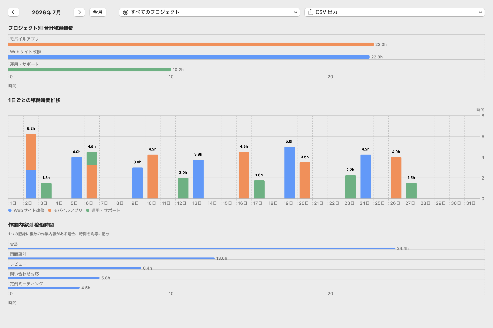
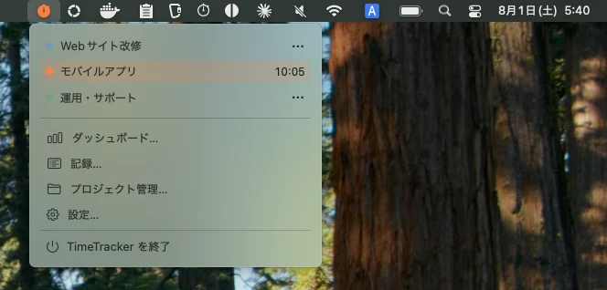

# TimeTracker

[English](README.md) | [简体中文](README.zh-CN.md)

macOS のメニューバーから、プロジェクトごとの作業時間を記録するタイムトラッカーです。

## 画面





- macOS 14 以降
- ローカル保存

## 主な機能

- メニューバーからタイマーを開始・停止。複数プロジェクトの同時計測や、過去の時刻からの開始にも対応しています。
- 一定時間操作がない場合はタイマーを自動停止し、離席時間を記録から除外します。
- 記録に作業内容を付け、リストや月間タイムラインから追加・編集できます。作業内容は複数のプロジェクトに紐づけられ、入力時には現在のプロジェクトで最近使った候補が表示されます。**すべて表示**を選ぶと、すべての候補を確認できます。
- 記録画面から作業内容の文言と紐づくプロジェクトを管理できます。文言を変更すると、過去の記録にも一貫して反映されます。
- 月ごとの作業時間を集計し、CSV で保存できます。
- プロジェクトを管理し、アイドル検知、Mac ログイン時の自動起動、表示言語などを設定できます。

## プライバシー

記録は Mac の中に保存され、外部へ送信しません。アイドル検知では入力内容を取得せず、最後のキーボードやマウス操作からの経過時間だけを使います。アクセシビリティ権限と入力監視権限は不要です。

## インストール

[最新のリリース](https://github.com/HappyOnigiri/TimeTracker/releases/latest)から `TimeTracker-vX.Y.Z.zip` をダウンロードして展開し、`TimeTracker.app` を `/Applications` に移動してください。

このアプリは ad-hoc 署名を使用しており、Apple の公証を受けていません。初回起動時は開発元を確認できないため、macOS によって起動を止められる場合があります。一度アプリを開こうとしたあと、**システム設定 > プライバシーとセキュリティ**を開き、「セキュリティ」までスクロールして**このまま開く**をクリックしてください。詳しくは [Apple の「未確認の開発元からの Mac アプリを開く」](https://support.apple.com/ja-jp/guide/mac-help/mh40616/mac)を参照してください。

### ソースからビルド

ソースからのビルドには Xcode と XcodeGen が必要です。XcodeGen は Homebrew でインストールできます。

```sh
brew install xcodegen
```

リポジトリを取得し、アプリをビルドして `/Applications` に配置します。

```sh
git clone https://github.com/HappyOnigiri/TimeTracker.git
cd TimeTracker
make install
```

`make install` は既存の `/Applications/TimeTracker.app` を置き換えます。

## コントリビュート

不具合や機能提案は [Issues](https://github.com/HappyOnigiri/TimeTracker/issues) へ、変更は Pull Request で送ってください。

Pull Request を作成する前に SwiftLint をインストールし、`make ci` が通ることを確認してください。

```sh
brew install swiftlint
make ci
```

## ライセンス

[MIT License](LICENSE) の下で公開しています。
