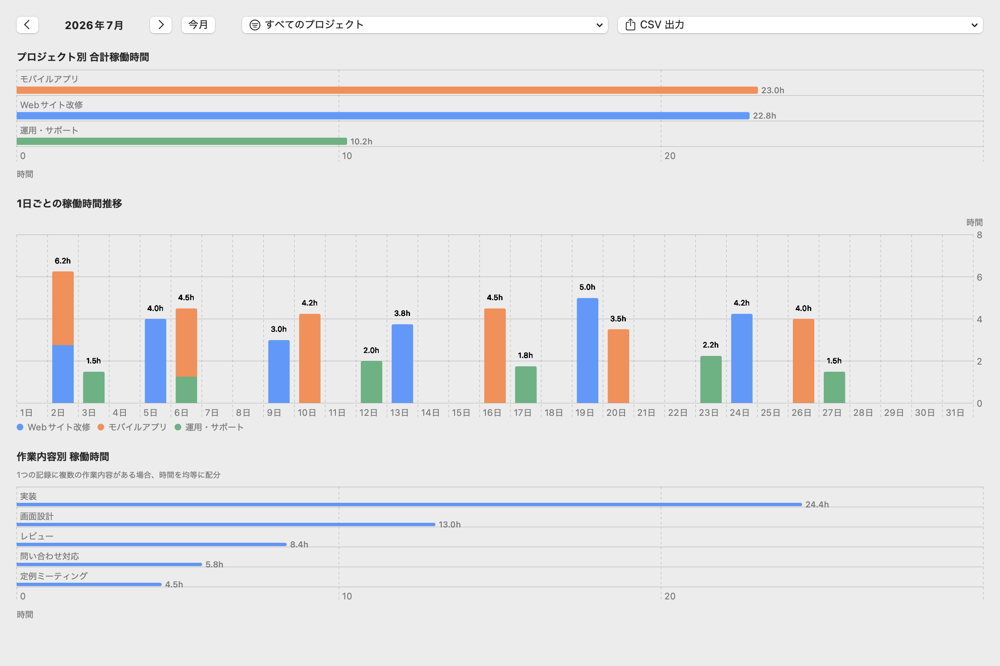
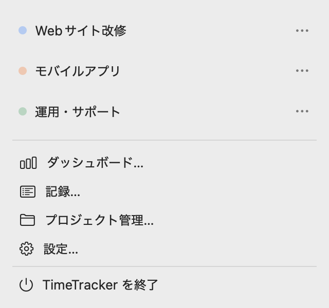

# TimeTracker

macOS のメニューバーから、プロジェクトごとの作業時間を記録するタイムトラッカーです。

## 画面





- macOS 14 以降
- ローカル保存

## 主な機能

- メニューバーからタイマーを開始・停止。複数プロジェクトの同時計測や、過去の時刻からの開始にも対応しています。
- 一定時間操作がない場合はタイマーを自動停止し、離席時間を記録から除外します。
- 記録に作業内容を付け、リストや月間タイムラインから追加・編集できます。
- 月ごとの作業時間を集計し、CSV で保存できます。
- プロジェクトを管理し、アイドル検知や Mac ログイン時の自動起動などを設定できます。

## プライバシー

記録は Mac の中に保存され、外部へ送信しません。アイドル検知では入力内容を取得せず、最後のキーボードやマウス操作からの経過時間だけを使います。アクセシビリティ権限と入力監視権限は不要です。

## インストール

Xcode と XcodeGen が必要です。XcodeGen は Homebrew でインストールできます。

```sh
brew install xcodegen
```

リポジトリを取得し、アプリを `/Applications` に配置します。

```sh
git clone https://github.com/HappyOnigiri/TimeTracker.git
cd TimeTracker
make install
```

`make install` は既存の `/Applications/TimeTracker.app` を置き換えます。

## コントリビュート

不具合や機能提案は [Issues](https://github.com/HappyOnigiri/TimeTracker/issues) へ、変更は Pull Request で送ってください。

Pull Request を作成する前に SwiftLint をインストールし、`make ci` が通ることを確認してください。

```sh
brew install swiftlint
make ci
```

## ライセンス

[MIT License](LICENSE) の下で公開しています。
