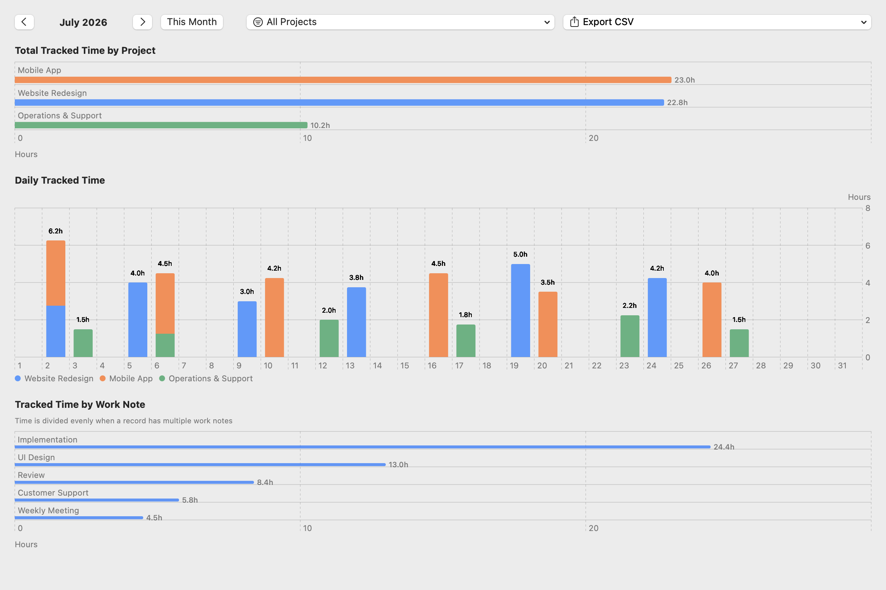
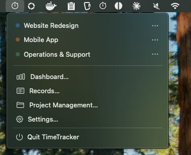

# TimeTracker

[English](README.md) | [日本語](README.ja.md)

TimeTracker 是一款在 macOS 菜单栏中按项目记录工作时间的应用。

## 截图





- 需要 macOS 14 或更高版本
- 所有数据均存储在本机

## 主要功能

- 从菜单栏开始或停止计时，支持同时记录多个项目，也可从过去的时间开始记录。
- 在一段时间没有操作后自动停止计时，并从记录中排除空闲时间。
- 为记录添加工作内容，并可在列表或月度时间线中进行编辑。工作内容可关联到多个项目；输入时会显示当前项目最近使用的候选内容，也可通过**显示全部**查看所有候选内容。
- 可在记录页面管理工作内容文本及其关联项目。重命名工作内容时，过去的记录也会同步更新并保持一致。
- 查看每月工作时长，并将报告导出为 CSV 文件。
- 管理项目，以及设置空闲检测、登录时启动、显示语言等偏好。

## 隐私

记录只保存在您的 Mac 上，绝不会发送到其他位置。空闲检测不会获取您的输入内容，只会检查距离上次键盘或鼠标操作所经过的时间。无需授予辅助功能或输入监控权限。

## 安装

从[最新版本](https://github.com/HappyOnigiri/TimeTracker/releases/latest)下载 `TimeTracker-vX.Y.Z.zip`，解压后将 `TimeTracker.app` 移到 `/Applications`。

本应用使用 ad-hoc 签名，且未经过 Apple 公证。首次打开时，macOS 可能会因为无法验证开发者而阻止应用运行。尝试打开应用后，请前往**系统设置 > 隐私与安全性**，向下滚动到“安全性”，然后点按**仍要打开**。详情请参阅 [Apple 关于打开来自身份不明开发者的 Mac App 的说明](https://support.apple.com/zh-cn/guide/mac-help/mh40616/mac)。

### 从源代码构建

从源代码构建需要 Xcode 和 XcodeGen。使用 Homebrew 安装 XcodeGen：

```sh
brew install xcodegen
```

克隆仓库，并将应用构建到 `/Applications`：

```sh
git clone https://github.com/HappyOnigiri/TimeTracker.git
cd TimeTracker
make install
```

`make install` 会替换 `/Applications/TimeTracker.app` 中已有的应用。

## 参与贡献

请通过 [Issues](https://github.com/HappyOnigiri/TimeTracker/issues) 报告问题或提出功能建议，并通过 Pull Request 提交更改。

创建 Pull Request 前，请安装 SwiftLint 并确认 `make ci` 成功：

```sh
brew install swiftlint
make ci
```

## 许可证

本项目基于 [MIT License](LICENSE) 发布。
